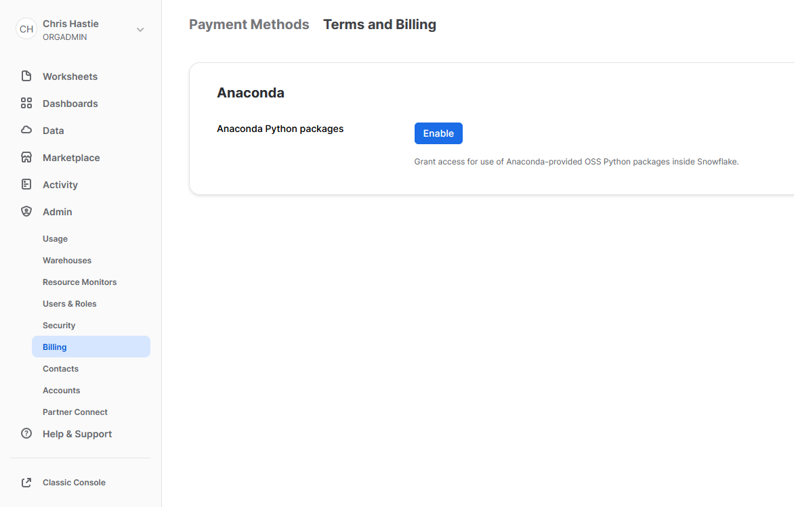
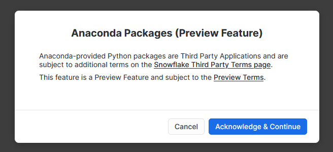
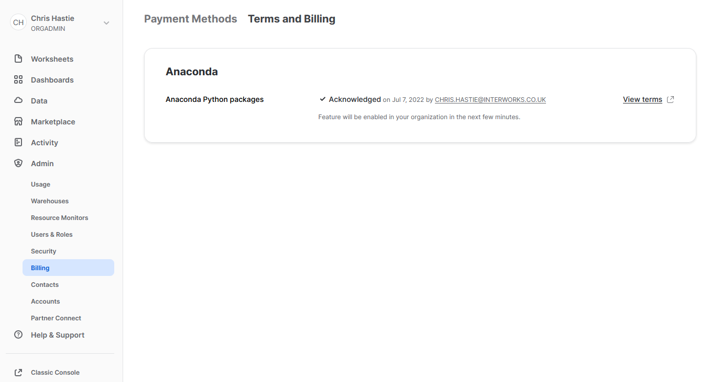

# Snowflake Python Functionality

Collection of Snowflake Stored Procedures and UDFs that leverage Python, along with a Python package to simplify connecting to Snowflake using Python.

## Articles

Many of the stored procedures and UDFs above are paired with articles available in the [Snowflake with Python series on the InterWorks blog](https://interworks.com/blog/series/snowflake-with-python).

## InterWorks Snowpark for Python

To simplify creating Snowpark sessions for the enclosed Python scripts, a custom module called "interworks_snowpark" has been used. More details can be found in the "interworks_snowpark" subdirectory. This subdirectory also contains instructions on how to configure your local environment for Snowpark for Python, along with how you can leverage `conda_requirements.yml` or `requirements.txt` files.

## Stored Procedures

The following stored procedures are available within the repository. The code for each is provided in two forms so that it can be leveraged from within the Snowflake UI or as part of a Snowpark for Python script.

- Multiply an integer by three
- Multiply two integers together
- Multiply all integers in an array by another integer
- Retrieve current user and date
- Create and modify a table via the SQL method
- Use variables whilst creating and modifying a table via the SQL method
- Basic version of executing a Snowflake METADATA command into a destination table
- Example of manipulating data with Pandas
- Generate a key pair for user authentication and apply it to a user (not best practice as private key may be visible in logs)
- Example to leverage external files via a mapping table
- Example to leverage external libraries via xlrd.xldate
- Execute a Snowflake METADATA command into a destination table
- Backup SNOWFLAKE shared database

## UDFs

The following User Defined Functions (UDFs) are available within the repository. The code for each is provided in two forms so that it can be leveraged from within the Snowflake UI or as part of a Snowpark for Python script.

- Multiply an integer by three
- Multiply two integers together
- Multiply all integers in an array by another integer
- Generate Snowflake-compliant key pairs for authentication
- Generate fake names
- Example to leverage external files via a mapping table
- Example to leverage external libraries via xlrd.xldate

## UDTFs

The following User Defined Table Functions (UDTFs) are available within the repository. The code for each is provided in two forms so that it can be leveraged from within the Snowflake UI or as part of a Snowpark for Python script.

- Hello world
- Hello world with an input
- Gemerate a calendar table between two dates
- Calculate the running sum of a given measure within a partition
- Calculate the average of a given measure within a partition
- Train and test an Auto ARIMA predictive model
- Train a linear regression model and use it to predict further values
- Example to leverage external files via a mapping table
- Example to leverage external libraries via xlrd.xldate

## Third Party Packages from Anaconda

To leverage third party packages from Anaconda within Snowflake, an ORGADMIN must first accept the [third party terms of usage](https://www.snowflake.com/legal/third-party-terms/). More details can be found [here](https://docs.snowflake.com/en/developer-guide/udf/python/udf-python-packages.html#using-third-party-packages-from-anaconda). This only needs to be enabled once for the entire organisation.

1. Using the ORGADMIN role in the SnowSight UI, navigate to `Admin` > `Billing` to accept the third party terms of usage

    

2. Confirm acknowledgement

    

3. The screen will then update to reflect the accepted terms

    
